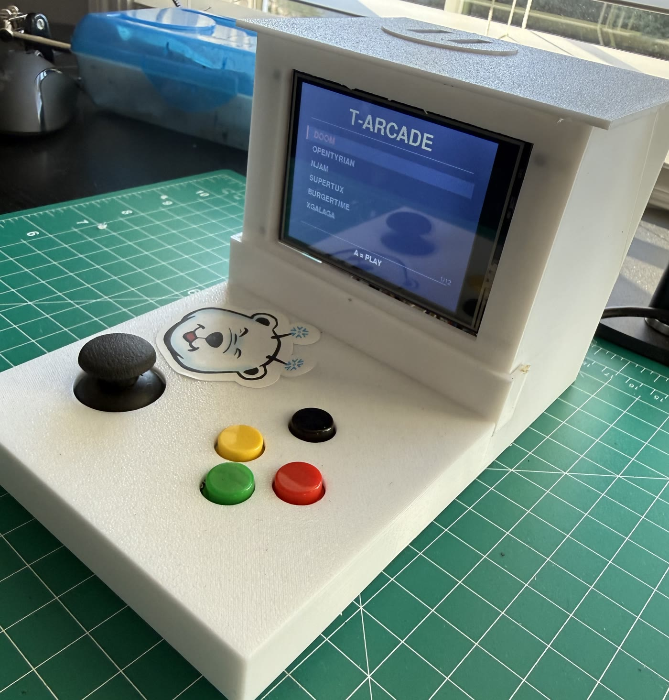
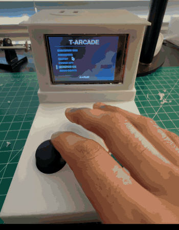

# T-ARCADE

A Raspberry Pi 5 arcade cabinet: a 320×240 SPI panel, an analog joystick
read through a 16-bit ADC, four buttons, and a launcher that runs real
Linux games on it.

<p align="center">
  
  
</p>

<p align="center">
  <sub>Left: the panel showing the launcher. Right: menu &rarr; SuperTux &rarr;
  njam &rarr; ninvaders &rarr; BurgerTime, with the GPIO handed to the game
  and reclaimed on exit each time.</sub>
</p>

The interesting part of this project is not the feature list. Most Pi
display projects are a tutorial followed successfully; this one hit
several undocumented walls on Pi 5 hardware — including a power fault
that took a controlled experiment to find — and
**[DEBUGGING.md](docs/DEBUGGING.md)** is the write-up of how each was
isolated.

---

## Hardware

| Component | Detail |
|-----------|--------|
| Board | Raspberry Pi 5, Raspberry Pi OS Trixie, Wayland (labwc) |
| Display | ILI9341 3.2" SPI LCD, 320×240, RGB565 |
| ADC | ADS1115 16-bit, I²C address 0x48 |
| Input | Analog joystick (VRx→A1, VRy→A3) + 4 tactile buttons |
| Buttons | A=GPIO5, B=GPIO6, Start=GPIO20, Select=GPIO21, active-low |

Three connections are not free choices, and each one cost time:

- **LCD CS must be GPIO8/CE0.** The `mipi-dbi-spi` overlay is bound to
  `spi0-0`, and CE0 is GPIO8.
- **The backlight goes to the 3.3 V rail, not a GPIO.** It draws 60–80 mA;
  a GPIO sources ~16 mA. See [Bug 4](docs/DEBUGGING.md#bug-4-random-shutdowns).
- **The joystick's VCC is 3.3 V, not 5 V.** The ADC's absolute maximum
  input is 3.6 V. See [Bug 3](docs/DEBUGGING.md#bug-3-joystick-over-driving-the-adc).

Full pinout and the reasoning: **[docs/WIRING.md](docs/WIRING.md)**.

---

## Quick start

```bash
sudo apt install python3-pygame python3-evdev python3-smbus2 \
                 python3-gpiozero python3-lgpio \
                 wlr-randr wmctrl xdotool xterm

git clone https://github.com/<you>/t-arcade.git
cd t-arcade

# 1. Panel: blacklist fbtft, install the init blob, write the overlay.
sudo bash scripts/setup_panel.sh
sudo reboot

# 2. Verify. Expect an output named SPI-1 and no fb_ili9341 in dmesg.
wlr-randr
dmesg | grep -i -e mipi -e fbtft

# 3. Controls. Wiggle the stick; the centre should read near 13200.
python3 src/arcade_input.py --test

# 4. Run it.
sudo -E python3 src/tarcade.py --monitor   # on the monitor first
sudo -E python3 src/tarcade.py             # on the panel

# 5. Start at login.
bash scripts/start_arcade.sh --setup
```

If the screen ever goes dark and stays dark, `scripts/mon` restores the
monitor. It is meant to be typed blind.

Every tunable value — paths, pins, ADC channels, calibration span,
timings, font sizes — is in **[`config.py`](config.py)**, with a comment
on each saying when you would change it.

---

## Architecture

```
config.py           every value specific to this cabinet
src/
  padmap.py         shared joystick/button decoding + 90° rotation
  arcade_input.py   reads hardware -> emits uinput keyboard events
  btaudio.py        Bluetooth speaker pairing, wraps bluetoothctl
  tarcade.py        launcher: menu, process lifecycle, display management
scripts/
  setup_panel.sh    one-time panel configuration
  start_arcade.sh   autostart wrapper (waits for the compositor)
  mon               restore the monitor, typed blind
  pmicwatch.sh      PMIC logger, used to rule out power in Bug 4
firmware/           ILI9341 init sequence, source and compiled blob
attic/              the framebuffer-mirror approach that did not work
```

Three decisions shaped everything else.

**Games get a virtual keyboard, not a gamepad.** A virtual gamepad only
works once udev permissions, the SDL input driver and the emulator's own
autodetection all agree, and each of those fails differently and silently.
Every game already reads a keyboard. Presenting one removed the entire
class of failure, at the cost of per-game key profiles — which turned out
to be useful anyway.

**GPIO ownership is handed off explicitly.** The launcher holds the pins
for menu navigation, fully releases them before a game starts, hands them
to `arcade_input.py`, and reclaims them on exit. "Fully" is doing work
there: `Button.close()` is not enough, because gpiozero's lgpio backend
holds the chip handle at the pin-factory level
([Bug 5](docs/DEBUGGING.md#bug-5-gpiozero-does-not-release-pins-on-close)).

**The panel becomes the only display, rather than a target.** Wayland will
not let an app place itself on a secondary output, and mirroring into
`/dev/fb1` writes to a buffer nobody scans out. Disabling the HDMI output
instead means ordinary fullscreen lands on the panel with no positioning,
no mirroring and no DRM negotiation. This replaced a much larger piece of
code; the one it replaced is in [`attic/`](attic/).

---

## Debugging highlights

The full write-ups are in **[docs/DEBUGGING.md](docs/DEBUGGING.md)**.

### Random shutdowns

The Pi powered off after 15 seconds to a few minutes, but only while a
game was running. Clean power-off, no panic, nothing in the journal.

Ruled out by measurement rather than guesswork:

- `vcgencmd get_throttled` → `0x0` — never undervolted, ever
- PMIC `power_reset` register → all zeros — no recorded power event
- 56–58 °C — not thermal
- Official 5 V/5 A supply
- A custom PMIC logger sampling at 5 Hz with `fsync`, so the last reading
  survives a power cut: `EXT5V_V` held **5.15–5.19 V to the final
  sample**, with no sag

So the logs exonerated everything. Isolation came from removing one
variable at a time instead:

| Test | Configuration | Result |
|------|---------------|--------|
| A | Idle, nothing running | survived |
| B | Full I²C polling, LCD unplugged | survived 15 min |
| C | Everything except the backlight wire | survived 15 min |

**Root cause:** the backlight drew 60–80 mA through GPIO18, a pin rated
for about 16 mA. Sustained 4–5× overcurrent tripped the RP1's protection
in microseconds — faster than any sampling rate, which is exactly why the
logs showed a healthy board right up to the moment it switched off.

**Fix:** move the backlight to the 3.3 V rail. The proper fix, if you want
brightness control back, is a MOSFET with GPIO18 on the gate.

### The other eight

| # | Symptom | Root cause |
|---|---------|------------|
| [1](docs/DEBUGGING.md#bug-1-panel-stayed-black-despite-correct-wiring) | Panel black despite correct wiring | Legacy `fbtft` matched `ili9341` first and consumed the SPI device before `panel-mipi-dbi-spi` could bind |
| [2](docs/DEBUGGING.md#bug-2-backlight-ignored-sysfs-but-responded-to-direct-pin-writes) | Backlight ignored sysfs, worked via `pinctrl` | `dtoverlay=pwm` also defaults to GPIO18; `gpio-backlight` lost the pin silently |
| [3](docs/DEBUGGING.md#bug-3-joystick-over-driving-the-adc) | ADC centre read 20377, not 13200 | Joystick on 5 V, 1.4 V past the ADC's absolute maximum input |
| [5](docs/DEBUGGING.md#bug-5-gpiozero-does-not-release-pins-on-close) | `lgpio.error: 'GPIO busy'` on handoff | `Button.close()` leaves the pin factory holding the chip |
| [6](docs/DEBUGGING.md#bug-6-x11-vs-wayland-on-secondary-drm-devices) | Panel vanished from `xrandr` under X11 | `modesetting` manages one DRM device; the panel is a second one |
| [7](docs/DEBUGGING.md#bug-7-launcher-vanished-after-exiting-a-game) | Launcher gone after exiting a game | Game invalidated the SDL surface; the font cache must be cleared on rebuild too |
| [8](docs/DEBUGGING.md#bug-8-sudo--e-refused) | `sudo -E` refused | The sudoers rule needs the `SETENV` tag |
| [9](docs/DEBUGGING.md#bug-9-bitmap-fonts-gone-on-trixie) | Terminal games unreadable | Trixie dropped the bitmap fonts, and XWayland ignores `xterm -fullscreen` |

One thing worth stating plainly: **`fbcp-ili9341` and every project like it
is dead on the Pi 5.** They drive the panel from userspace through
DispmanX or PIGPIO, and both are gone now that GPIO and SPI live on the
RP1 southbridge. There is no drop-in replacement, which is why the
tutorials do not cover any of this.

---

## Tests

```bash
pip install pytest
python3 -m pytest tests/ -q
```

Hardware is stubbed in `tests/conftest.py`, so the suite runs on a laptop
with no Pi attached. What is covered is what was actually hard:

| File | Covers |
|------|--------|
| [`test_padmap.py`](tests/test_padmap.py) | The 90° rotation truth table, the deadzone, ADS1115 sign extension, calibration |
| [`test_process.py`](tests/test_process.py) | `kill_tree` against a real process that ignores `SIGTERM`, plus its child |
| [`test_display.py`](tests/test_display.py) | The `enable_output` escalation chain, step by step |
| [`test_term_geometry.py`](tests/test_term_geometry.py) | Font sizing at 320×240, 640×480 and 1080p |
| [`test_btaudio.py`](tests/test_btaudio.py) | MAC-shaped device names, persisted state |
| [`test_profiles.py`](tests/test_profiles.py) | Key profiles and the game table stay consistent |

---

## Limitations

Stated plainly, because they are structural rather than unfinished work.

- **SPI bandwidth caps the panel at ~25–30 fps.** 320 × 240 × 16 bpp =
  153,600 bytes per frame; at 48 MHz that is ~26 ms of bus time. Fine for
  1980s arcade, NES and Game Boy. Painful past SNES.
- **The Pi 5 cannot wake from GPIO.** Only the J2 solder pads remote the
  power button, so shutdown is software-only and power-on is a physical
  button press.
- **Bluetooth audio adds ~100–200 ms of latency.** Noticeable in anything
  where sound is feedback rather than atmosphere. A USB or 3.5 mm speaker
  avoids it.
- **Four buttons rules out fighting games** and anything else needing six
  or more inputs. The Start+Select combination is already spoken for.
- **The backlight is not dimmable** after the GPIO18 fix. It is wired
  straight to 3.3 V. A MOSFET would restore control.
- **Wayland only.** X11 cannot see the panel at all
  ([Bug 6](docs/DEBUGGING.md#bug-6-x11-vs-wayland-on-secondary-drm-devices)).
- **An HDMI display would have been easier.** A 4–5" HDMI panel costs about
  the same, gives 60 fps, and requires no driver work whatsoever. Choosing
  SPI is what produced everything in DEBUGGING.md. It was worth it for what
  it taught; it was not the shortest path to a working cabinet.

---

## License

MIT — see [LICENSE](LICENSE).
